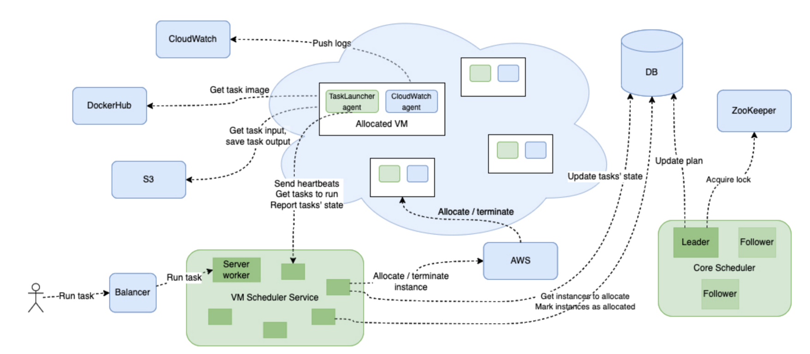

## VM Scheduler architecture

There are three main components in the system:
- the scheduler service 
- the core scheduler
- agents that are allocated on instances.

The core scheduler is engaged in generating a plan.
The plan contains job assignments to virtual machines.
Only one of the replicas of cre scheduler has to be active at any time,
this is what distributed locking via ZooKeeper is used for.

The scheduler service communicates with the user and agents, providing gRPC API,
allocates instances and runs failure detector.

Postgres is used as a persistent data storage.

### Main scenario

- The user adds a task containing several jobs to the scheduler.
After new task data is saved to the database,
the user receives a response with the task ID and the `Queued` status.

- The job planning iteration starts.
The scheduler takes the current state of the system (all active jobs and virtual machines) from the database.
The job is active if its status is not final.
The VM is active if it is not stopped or its termination is not scheduled yet.
At this stage, a scheduling algorithm is started, which results in an assignment of jobs to virtual machines.
Virtual machines may already be allocated, or their allocation will be planned.
Also, some VMs may be marked as pending termination.
The scheduling result is saved in the database.

- Allocator workers monitor the status of virtual machines in the database.
If there are VMs in the status of waiting for allocation or waiting for completion,
the allocator makes the appropriate API calls to the cloud provider and writes the allocation status to the database.

- When a virtual machine is allocated, the agent is launched on it.
The agent periodically polls the scheduler service about the jobs assigned to its VM.
The agent operates only with jobs, not tasks.
When the agent receives an assigned job, the agent polles the docker image and launches the container.
While the job is running, the agent sends heartbeats to the scheduler.
When the task is completed, the agent saves the result to S3 and informs the scheduler about the status of the completed job.

- During the entire task execution time, the user can poll its status.
When the task is completed, the user can get a link to the result lying in S3.
The scheduler also provides API for canceling a task.

### Implementation details

Classes diagram (server side):

The scheduler is written in C++ and provides the gRPC API.
The gRPC server implements an API for external users and for agents (see classes in relation to composition with GrpcServer).

The Allocator class is responsible for allocating virtual machines.
Contains an interface object (pure abstract class) CloudClient.
At the moment, only one implementation of the interface for the AWS cloud has been written.
(In the future, support for other clouds may appear, you just need to implement the CloudClient interface.)
Idempotency of virtual machine allocation is achieved by specifying a unique token when calling the AWS SDK allocation method.

In this system parts of the system may fail.
Failure is any incorrect behavior:
for example, the agent's start is too long, the agent stops working due to the server restart
(at the will of the cloud provider or due to problems with the agent's software, tasks being started, for example, OOM),
an allocated VM, a record of which is missing in the database
(this can happen because of non-atomic allocation and database entries).
The failure detector detects such failures and processes them.

The Scheduler class implements the scheduling of virtual machines.
Contains an object of the VmAssigner interface,
which implements the algorithm for assigning tasks to virtual machines.

The TaskRegistry class contains objects of the GrpcServer, Allocator, Scheduler, and FailureDetector classes.

Job state diagram:

When a task is added to the scheduler, the jobs it contains are added with the `Queued` status.
When the plan is committed, the statuses of jobs that are assigned to virtual machines are transferred from `Queued` to `Scheduled`.
When the corresponding virtual machine is allocated and the agent is running on it,
the agent learns from the scheduler about the assigned job (gRPC call `getAssignedJobs`) and starts it.
Next, the agent makes a gRPC call (`updateJobState`), in which it reports that the task has started executing.
The scheduler sets the `Running` status in the database.
If the task is completed successfully, the agent passes a link to the task result to S3 using the same call.
In this case, the scheduler sets the `Completed` status to the job.
If the container is terminated with a non-zero return code, the agent sends the `Error` status,
which is also recorded to the database.

The task can be canceled either by the user or by the scheduler itself (namely, the failure detector component)
if the task is not completed within the planned execution time passed by the user.
The canceled job is transferred to the `Cancelling` and eventually to `Cancelled` status.

The remaining transitions (indicated by dotted blue arrows) are made by a failure detector.

VM state diagram:

When the scheduler commits a new job assignment plan,
new VMs are created in the `PendingAllocation` status.
The allocator retrieves VMs with this status from the database,
sets `Allocating` status in the same transaction, and commits the transaction.
The allocator then makes calls to the AWS API to allocate the physical VM and run the agent on it.
If the allocation is successful, the virtual machine is moved to `Allocated` status
(changes the value in the corresponding column of the database record).
If the allocation is unsuccessful, the VM is moved to the `PendingAllocation` status
and will be processed at another allocation iteration.

Situations when a virtual machine was allocated but the database record failed for some reason (e.g., network error)
or the VM status remained in the intermediate `Allocating` state due to server restart are handled by the failure detector
(blue dotted transitions).

After the virtual machine is allocated, an agent is started on it and periodically sends heartbeats.
When the server receives the first heartbeat, it sets the `AgentStarted` status of the VM in the database.

When the Scheduler decides to terminate the VM, it sets the status to `PendingTermination` in the database.
Further transitions to `Terminating`, `Terminated` are similar to transitions to `Allocating`, `Allocated`.

DB schema:

